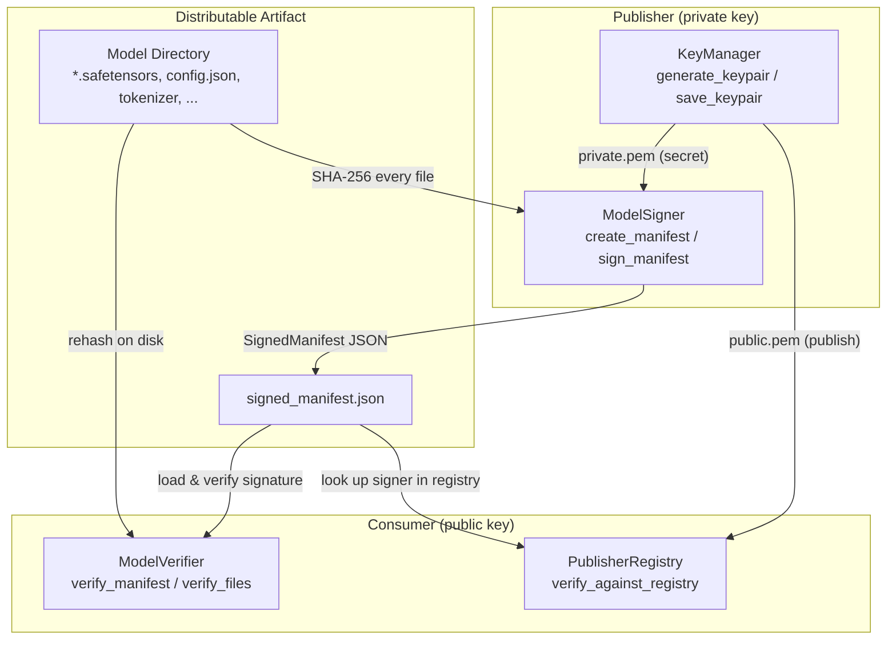

# aumai-modelseal

Cryptographic signing and verification for ML model artifacts.

[](https://github.com/aumai/aumai-modelseal/actions)
[](https://pypi.org/project/aumai-modelseal/)
[](LICENSE)
[](https://python.org)

---

## What is this?

Imagine you download a model weight file from the internet. How do you know it came from
who it claims? How do you know nobody tampered with it after it was published? Without
a way to verify provenance, you are trusting whoever happens to be hosting the file.

**aumai-modelseal** solves this the same way your web browser trusts HTTPS certificates
and the same way a notary certifies a document: **cryptographic signing**.

When a researcher or organization publishes a model, they use their private key to
produce a signature over a **manifest** — a complete inventory of every file in the model
artifact, with its SHA-256 fingerprint. Anyone who later receives that model can:

1. Verify the signature matches the publisher's public key (proves authenticity).
2. Rehash every file on disk and compare against the manifest (proves integrity).

If either check fails, something is wrong — the model was corrupted in transit, modified
by a third party, or did not come from who you think.

---

## Why does this matter?

### The supply-chain problem in ML

Software projects solved package signing decades ago (PGP signatures, Sigstore, etc.).
ML has not caught up. Model weights are multi-gigabyte blobs often served over plain
HTTP with no formal provenance mechanism. Real-world incidents have demonstrated that:

- Malicious actors can substitute weight files with trojaned versions that behave
  correctly on benchmarks but execute adversarial behaviour in production.
- Legitimate authors can update models without bumping versions, silently altering
  deployed behaviour in ways that violate SLAs.
- Storage providers can corrupt files at rest and there is no automatic detection.

aumai-modelseal brings the well-understood **sign-then-verify** workflow to the ML
artifact lifecycle. It does not invent new cryptography — it applies proven algorithms
(Ed25519, ECDSA P-256) to the manifest pattern already used in container image signing
(OCI Image Manifest) and software package repositories.

### Why a manifest instead of signing weights directly?

Large model files (tens of GB) make whole-file signing slow. A manifest enumerates
every file with its hash in a small JSON document. Signing the manifest (typically
a few kilobytes) is instantaneous, yet provides the same security guarantee because
any change to any file changes its SHA-256, which invalidates the manifest.

---

## Architecture



---

## Features

| Feature | Description |
|---|---|
| **Ed25519 signing** | Default algorithm — 64-byte signatures, extremely fast verification |
| **ECDSA P-256 signing** | Alternative for HSMs and environments that require NIST curves |
| **Passphrase-protected keys** | Encrypt private keys at rest with BestAvailableEncryption |
| **Recursive manifest generation** | Walk any directory; hash every file in 64 KB chunks |
| **File-integrity verification** | Re-hash on-disk files and compare against the manifest |
| **Trusted publisher registry** | JSON-backed registry of known-good public keys |
| **Detached signatures** | Signature stored separately; weights unchanged |
| **Canonical JSON serialisation** | Deterministic byte representation ensures reproducible signatures |
| **Structured Pydantic models** | All data structures are typed and validated |
| **Full CLI** | `keygen`, `sign`, `verify`, `inspect` commands out of the box |

---

## Quick Start

### Install

```bash
pip install aumai-modelseal
```

### Step 1 — Generate a key pair

```bash
aumai-modelseal keygen --output ./my-keys
# Key pair (ed25519) written to 'my-keys/'
#   Private: my-keys/private.pem
#   Public : my-keys/public.pem
```

### Step 2 — Sign a model directory

```bash
aumai-modelseal sign \
  --model-dir ./my-model \
  --key ./my-keys/private.pem \
  --signer-id alice@example.com \
  --model-name "my-classifier" \
  --model-version "1.0.0" \
  --framework pytorch
# Signed manifest written to: ./my-model/signed_manifest.json
#   Files    : 4
#   Total    : 2,147,483,648 bytes
#   Signer   : alice@example.com
#   Algorithm: ed25519
```

### Step 3 — Verify

```bash
aumai-modelseal verify \
  --manifest ./my-model/signed_manifest.json \
  --key ./my-keys/public.pem \
  --model-dir ./my-model
# Signature: VALID
#   Signer   : alice@example.com
#   Model    : my-classifier v1.0.0
# Verifying on-disk file hashes...
#   [OK] config.json
#   [OK] model.safetensors
# All files verified successfully.
```

---

## CLI Reference

### `aumai-modelseal keygen`

Generate an asymmetric key pair and write PEM files to a directory.

```
Usage: aumai-modelseal keygen [OPTIONS]

  Generate an asymmetric key pair for model signing.

Options:
  --output DIR          Directory to write private.pem and public.pem.
                        [default: keys]
  --algorithm CHOICE    Signing algorithm: ed25519 | ecdsa_p256
                        [default: ed25519]
  --version             Show the version and exit.
  --help                Show this message and exit.
```

**Examples:**

```bash
# Default Ed25519 key pair
aumai-modelseal keygen --output ./signing-keys

# ECDSA P-256 for HSM-compatible environments
aumai-modelseal keygen --algorithm ecdsa_p256 --output ./ecdsa-keys
```

---

### `aumai-modelseal sign`

Walk a model directory, build a manifest with SHA-256 hashes for every file,
sign it with the private key, and write `signed_manifest.json`.

```
Usage: aumai-modelseal sign [OPTIONS]

  Sign a model directory and write the signed manifest to disk.

Required:
  --model-dir DIR     Directory containing model files.
  --key PATH          Path to private PEM key file.
  --signer-id ID      Signer identity string (e.g. email or org identifier).

Optional:
  --model-name TEXT       Override model name (defaults to directory name).
  --model-version TEXT    Semantic version string.          [default: 0.0.0]
  --framework TEXT        Framework name (pytorch, jax, etc).
                                                           [default: unknown]
  --author TEXT           Author or team name.
  --output PATH           Output path for signed manifest JSON.
                          Default: <model-dir>/signed_manifest.json
```

**Examples:**

```bash
# Minimal invocation
aumai-modelseal sign \
  --model-dir ./weights \
  --key ./keys/private.pem \
  --signer-id ci@myorg.com

# Full metadata, custom output path
aumai-modelseal sign \
  --model-dir ./weights \
  --key ./keys/private.pem \
  --signer-id releases@myorg.com \
  --model-name "sentiment-v2" \
  --model-version "2.1.3" \
  --framework "transformers" \
  --author "ML Platform Team" \
  --output ./dist/sentiment-v2.signed.json
```

---

### `aumai-modelseal verify`

Verify the cryptographic signature on a signed manifest. Optionally re-hash
the on-disk files to check integrity as well as authenticity.

```
Usage: aumai-modelseal verify [OPTIONS]

  Verify the cryptographic signature of a signed manifest.

Required:
  --manifest PATH    Path to signed manifest JSON.
  --key PATH         Path to public PEM key file.

Optional:
  --model-dir DIR    If supplied, also verify on-disk file hashes.
```

**Exit codes:**

| Code | Meaning |
|---|---|
| 0 | Signature valid (and all files OK if `--model-dir` supplied) |
| 1 | Error loading the manifest or key file |
| 2 | Signature invalid, or one or more file hashes failed |

```bash
# Signature check only
aumai-modelseal verify \
  --manifest ./signed_manifest.json \
  --key ./keys/public.pem

# Full check: signature + file hashes
aumai-modelseal verify \
  --manifest ./signed_manifest.json \
  --key ./keys/public.pem \
  --model-dir ./my-model
```

---

### `aumai-modelseal inspect`

Display human-readable or raw JSON contents of a signed manifest without
performing any cryptographic verification.

```
Usage: aumai-modelseal inspect [OPTIONS]

  Display the contents of a signed manifest.

Required:
  --manifest PATH    Path to signed manifest JSON.

Optional:
  --json-output      Emit raw JSON instead of formatted text.
```

```bash
# Human-readable summary
aumai-modelseal inspect --manifest ./signed_manifest.json

# Raw JSON — pipe to jq for querying
aumai-modelseal inspect --manifest ./signed_manifest.json --json-output | jq .signature
```

---

## Python API

### Generate and save a key pair

```python
from aumai_modelseal import KeyManager, SignatureAlgorithm

km = KeyManager()

# Ed25519 (default, fastest)
private_pem, public_pem = km.generate_keypair(SignatureAlgorithm.ed25519)
km.save_keypair(private_pem, public_pem, path="./keys")

# ECDSA P-256
private_pem, public_pem = km.generate_keypair(SignatureAlgorithm.ecdsa_p256)
km.save_keypair(private_pem, public_pem, path="./ecdsa-keys")

# Passphrase protection
private_pem, public_pem = km.generate_keypair(
    SignatureAlgorithm.ed25519,
    passphrase=b"my-secret",
)
```

### Build and sign a manifest

```python
from aumai_modelseal import KeyManager, ModelSigner

km = KeyManager()
private_key_bytes = km.load_private_key("./keys/private.pem")

signer = ModelSigner()

# Build a manifest by walking the directory
manifest = signer.create_manifest(
    model_dir="./my-model",
    model_name="my-classifier",
    model_version="1.0.0",
    framework="pytorch",
    author="Alice",
    description="Sentiment classifier fine-tuned on product reviews.",
)

# Sign the manifest
signed = signer.sign_manifest(
    manifest=manifest,
    private_key_bytes=private_key_bytes,
    signer_id="alice@example.com",
)

# Persist as JSON
with open("signed_manifest.json", "w", encoding="utf-8") as f:
    f.write(signed.model_dump_json(indent=2))
```

### Verify a signed manifest

```python
from aumai_modelseal import KeyManager, ModelVerifier, SignedManifest

km = KeyManager()
public_key_bytes = km.load_public_key("./keys/public.pem")

with open("signed_manifest.json", encoding="utf-8") as f:
    signed = SignedManifest.model_validate_json(f.read())

verifier = ModelVerifier()

# Verify signature
result = verifier.verify_manifest(signed, public_key_bytes)
if result.valid:
    print(f"Verified. Signed by: {result.signer_id}")
    print(f"Model: {result.manifest.model_name} v{result.manifest.model_version}")
else:
    print(f"INVALID: {result.error}")

# Verify on-disk file hashes
file_results = verifier.verify_files("./my-model", signed.manifest)
for path, ok in file_results:
    print(f"{'OK  ' if ok else 'FAIL'}: {path}")
```

### Trusted publisher registry

```python
import base64
from datetime import UTC, datetime
from aumai_modelseal import PublisherRegistry, TrustedPublisher

# Create or load a persistent registry
registry = PublisherRegistry(registry_path="./trust-registry.json")

# Register a trusted publisher
public_pem = open("./keys/public.pem", "rb").read()
publisher = TrustedPublisher(
    publisher_id="alice@example.com",
    name="Alice (ML Platform)",
    public_key=base64.b64encode(public_pem).decode(),
    trusted_since=datetime.now(tz=UTC),
)
registry.add_publisher(publisher)

# Verify a manifest — registry looks up the signer automatically
result = registry.verify_against_registry(signed)
if result.valid:
    print("Trusted publisher confirmed.")
else:
    print(f"Untrusted: {result.error}")

# List all trusted publishers
for pub in registry.list_publishers():
    print(f"{pub.publisher_id} — trusted since {pub.trusted_since.date()}")
```

---

## Configuration Options

### Passphrase-protected private keys

Private key files can be encrypted at rest. The `load_private_key` method validates
the passphrase immediately on load, giving a clear error before any signing attempt.

```python
km = KeyManager()

# Generate encrypted key
private_pem, public_pem = km.generate_keypair(
    SignatureAlgorithm.ed25519,
    passphrase=b"super-secret",
)
km.save_keypair(private_pem, public_pem, path="./protected-keys")

# Load — must supply the same passphrase
private_key_bytes = km.load_private_key(
    "./protected-keys/private.pem",
    password=b"super-secret",
)

# Sign with encrypted key
signed = signer.sign_manifest(
    manifest=manifest,
    private_key_bytes=private_key_bytes,
    signer_id="ci@myorg.com",
    password=b"super-secret",
)
```

### Choosing a signing algorithm

| Algorithm | Key size | Signature size | Use when |
|---|---|---|---|
| `ed25519` | 32 bytes | 64 bytes | Default; fastest, most compact |
| `ecdsa_p256` | 32 bytes | ~70 bytes | NIST P-256; required by some HSMs and compliance frameworks |

Both algorithms are accepted transparently by `ModelVerifier.verify_manifest` — the
algorithm is stored in the manifest signature and auto-detected.

---

## How It Works — Technical Deep Dive

### Canonical manifest serialisation

Before signing, the manifest is serialised to a **canonical JSON byte string** using
`sort_keys=True` with no extra whitespace. This guarantees that two `ModelManifest`
objects with identical data always produce the same bytes — a prerequisite for
reproducible signatures.

```python
# core.py
def _canonical_manifest_bytes(manifest: ModelManifest) -> bytes:
    data = manifest.model_dump(mode="json")
    return json.dumps(data, sort_keys=True, separators=(",", ":")).encode("utf-8")
```

### Signing internals

The raw signature bytes are hex-encoded and stored alongside the base64-PEM public key
in the `Signature` model. This keeps the signed manifest self-contained: verification
requires no external state other than the public key.

- **Ed25519**: `Ed25519PrivateKey.sign(payload)` — the algorithm hashes internally.
- **ECDSA P-256**: `EllipticCurvePrivateKey.sign(payload, ECDSA(hashes.SHA256()))`.

### File hashing

`ModelSigner.create_manifest` walks the model directory with `Path.rglob("*")`,
sorted for determinism. Each file is hashed in 64 KB chunks to avoid loading large
weight files into memory. Missing files and zero-byte files are handled correctly.

### Verification

`ModelVerifier.verify_manifest` reconstructs the canonical bytes from the manifest,
decodes the hex signature, loads the public key, and calls the appropriate primitive.
Any exception (wrong key, corrupted signature, unsupported key type) is caught and
returned as an invalid `VerificationResult` with a descriptive error message.

### Registry persistence

`PublisherRegistry` persists to a JSON file on every mutation. The file is reloaded
automatically when a registry is instantiated with a path that already exists.

---

## Integration with Other AumAI Projects

- **aumai-specs** — Define typed model artifact contracts with aumai-specs; enforce
  their integrity at runtime with aumai-modelseal's signing workflow.
- **aumai-chaos** — Inject signature-verification failures into your model-loading
  pipeline to verify that your application handles tampered artifacts gracefully.
- **aumai-pii-redactor** — Before signing a model card or evaluation dataset, run
  aumai-pii-redactor to ensure no PII is embedded in artifact metadata.

---

## Contributing

Contributions are welcome. Please read `CONTRIBUTING.md` for the full workflow.

- Open an issue before starting large changes.
- Follow conventional commits (`feat:`, `fix:`, `refactor:`, `docs:`, `test:`).
- All new code requires type annotations; mypy strict must pass.
- Run `make lint test` before submitting a PR.

---

## License

Apache License 2.0. See [LICENSE](LICENSE) for full text.

Copyright 2024 AumAI Contributors.
